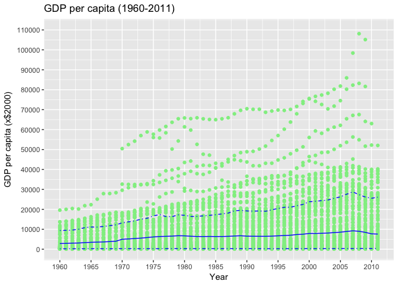
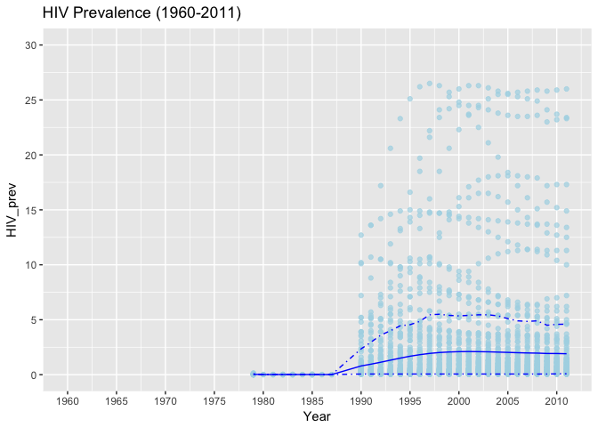
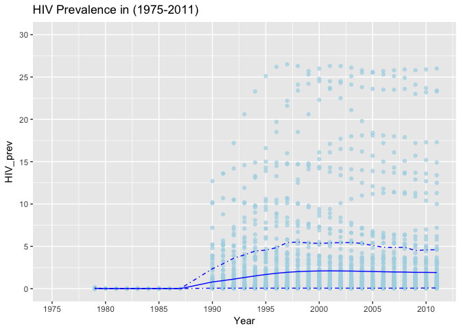
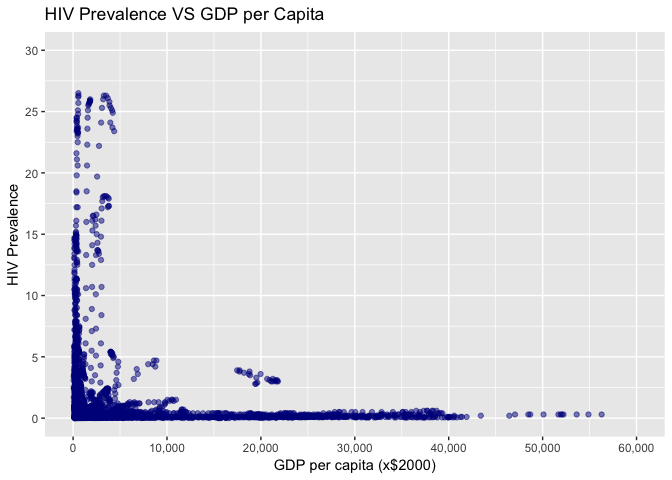
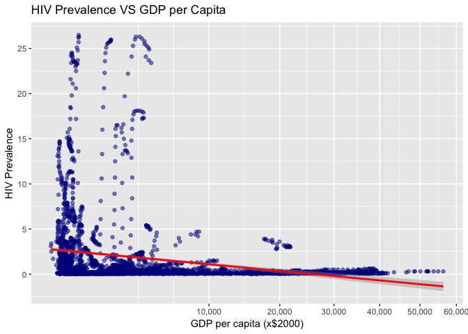

Exploratory Data Analysis - GapMinder Health Data
================
Hamza Bendemra

Introduction
------------

In this repo, I present an R Markdown file that I created after completing a lesson in UDacity's [Data Analyst Nanodegree](https://ae.udacity.com/course/data-analyst-nanodegree--nd002). We explore two data sets related to the Health sector. This submission included the R code used.

-   Method: Exploratory Data Analysis (EDA); Correlation; Linear Regression
-   Program: R programming language, RStudio
-   Topic: Health
-   Sources: World Health Organization; World Bank

The Data
--------

In this data analysis, I use data available on [GapMinder's data sets](https://www.gapminder.org/data/). Specifically, I focused on *GDP/capita (US$, inflation-adjusted)* sourced from the World Bank (WB) and the *Prevalence of HIV among adults aged 15–49 (%)* sourced from Wolrd Health Organisation (WHO).

The Question
------------

The question I am asking in this analysis: Is there a correlation between GDP per Capita and prevalence of HIV in the 15-49 age bracket? And if yes, how strong is that correlation?

My expectation is that there is a negative correlation between GDP per Capita and HIV Prevalence; meaning that poorer countries have higher rates of HIV.

Data Wrangling
--------------

Let's do some initial data wrangling to prep our data for analysis.

``` r
# read the CSV downloaded from GapMinder on "GDP Per Capita" and assign a dataframe to it
gdp <- read.csv("GDPpercapita.csv", header=T, check.names = F)
# let's reorganise the data by using key-value relationships to make a more useful dataframe for our upcoming analysis
gdp.T <- gather(data=gdp, key='Year', value='GDP', '1960':'2011',convert = TRUE)
```

Let's have a look at the structure of the resulting dataframe

``` r
str(gdp.T)
```

    ## 'data.frame':    14300 obs. of  3 variables:
    ##  $ Income per person (fixed 2000 US$): Factor w/ 275 levels "Abkhazia","Afghanistan",..: 1 2 3 5 6 7 8 9 10 12 ...
    ##  $ Year                              : int  1960 1960 1960 1960 1960 1960 1960 1960 1960 1960 ...
    ##  $ GDP                               : num  NA NA NA NA 1280 ...

``` r
# range of years that the dataset includes
range(gdp.T$Year)
```

    ## [1] 1960 2011

The dataset features 14,300 observations of 3 variables (Country, Year, GDP). The column 'Country' lists 275 countries. GDP per Capita is provided for the 275 countries from 1960-2011.

``` r
# read the CSV downloaded from GapMinder on "HIV Prevalence" and assign a dataframe to it
hiv <- read.csv("indicator_hiv_estimated_prevalence_15-49.csv", header=T, check.names = F)
# some data wrangling needed to ensure I can use the data in the type I need later on
hiv.T <- gather(data=hiv, key='Year', value='HIV_prev', '1979':'2011', convert = TRUE)
hiv.T$HIV_prev <- as.numeric(hiv.T$HIV_prev)
```

``` r
# let's have a look at the structure of the resulting dataframe
str(hiv.T)
```

    ## 'data.frame':    9075 obs. of  3 variables:
    ##  $ Estimated HIV Prevalence% - (Ages 15-49): Factor w/ 275 levels "Abkhazia","Afghanistan",..: 1 2 3 5 6 7 8 9 10 12 ...
    ##  $ Year                                    : int  1979 1979 1979 1979 1979 1979 1979 1979 1979 1979 ...
    ##  $ HIV_prev                                : num  NA NA NA NA NA ...

``` r
# changing column names to make them more appropriate
names(gdp.T)[[1]] <- "Country"
names(hiv.T)[[1]] <- "Country"
```

``` r
# combining dataframes into one for analysis
gdp.HIV <- merge(gdp.T, hiv.T)
str(gdp.HIV)
```

    ## 'data.frame':    9075 obs. of  4 variables:
    ##  $ Country : Factor w/ 275 levels "Abkhazia","Afghanistan",..: 1 1 1 1 1 1 1 1 1 1 ...
    ##  $ Year    : int  1979 1980 1981 1982 1983 1984 1985 1986 1987 1988 ...
    ##  $ GDP     : num  NA NA NA NA NA NA NA NA NA NA ...
    ##  $ HIV_prev: num  NA NA NA NA NA NA NA NA NA NA ...

After some data wrangling, we now have a data frame which we can use with countries listed in a column, a year in a separate, the GDP for that country in that year in a third column, and finally the measured HIV Prevalence for that country in that year in a fourt colum.

An initial exploration of the data
----------------------------------

Datasets often feature missing data. I suspect it would be the case with this dataset also even if sourced from an official organisation. Let's have a look at the % of missing GDP data.

``` r
sum(is.na(gdp.HIV$GDP)) / nrow(gdp.HIV) * 100
```

    ## [1] 35.30579

About 35.3% of the colum listing GDP per Capita have missign data. This is quite substantial and is most likely due the fact that reliable measurements of GDP have only started in the last few decades. Rather than replacing the missign data with an average or an estimate, missing data will be dimissed in the subsequent analysis.

Let's have a look at the percentage of missing data on the HIV Prevalence front.

``` r
sum(is.na(gdp.HIV$HIV_prev)) / nrow(gdp.HIV) * 100
```

    ## [1] 63.62534

We have an even higher rate at 63.6% with missign data, although this is most likely due the fact that reliable measurements of HIV associated metrics have only really been performed on a large scale from the early-1980s and our dataset goes back to 1961, before HIV/Aids became a recognished major health crisis.

Let's get an initial sense of the type of distribution we may getting from both data sets. For the GDP per capita:

``` r
summary(gdp.HIV$GDP)
```

    ##      Min.   1st Qu.    Median      Mean   3rd Qu.      Max.      NA's 
    ##     54.51    590.26   2038.88   7315.07   9239.73 108111.21      3204

Regarding the HIV prevalence:

``` r
summary(gdp.HIV$HIV_prev)
```

    ##    Min. 1st Qu.  Median    Mean 3rd Qu.    Max.    NA's 
    ##   0.010   0.100   0.300   1.743   1.200  26.500    5774

The Plots
---------

In this section, I generate various plots to get an overview of the data's distribution and attempt to identify trends and patterns.

First, we look at the overall data set and generate a scatter plot of GDP per Capita for the 275 countries listed in our dataset from 1960 to 2011. We also overlay on our plot, the mean and the upper-lower limits (95%-5%) of GDPs for each year. This will give us a better understanding of where the bulk of our distribution lies.

``` r
gdp_summary_GDP <- ggplot(data=subset(gdp.T, !is.na(gdp.T$GDP)),
                      aes(x=Year, y=GDP, group=1)) +
  geom_point(alpha=1, color='LightGreen') +
  geom_line(stat='summary', fun.y = mean, color='Blue') +
  geom_line(stat='summary', fun.y = quantile,
            fun.args = list(probs=0.1),
            linetype=4, color='Blue') +
  geom_line(stat='summary', fun.y = quantile,
            fun.args = list(probs=0.9),
            linetype=4, color='Blue') +
  labs(title="GDP per capita (1960-2011)", 
       y = "GDP per capita (x$2000)", 
       x = "Year") +
  scale_x_continuous(limits = c(1960, 2011), breaks=seq(1960, 2011, 5)) +
  scale_y_continuous(limits = c(0, 110000), breaks=seq(0, 110000, 10000))

gdp_summary_GDP 
```



The plot clearly shows an overall increasing trend in Global GDP between 1960 and 2011. The bulk of the data falls at a maximum GDP per Capita of USD 30,000 (xUSD 2,000).

Then, let's look at the data set on HIV Prevalence by generating a scatter plot of HIV Prevalence for the 275 countries listed in our dataset from 1960 to 2011. Just like we did wth GPD Per Capita, we also overlay on our plot, the mean and the upper-lower limits (95%-5%) of GDPs for each year. This will give us a better understanding of where the bulk of our distribution lies.

``` r
gdp_summary_HIV <- ggplot(data=subset(hiv.T, !is.na(hiv.T$HIV_prev)),
                      aes(x=Year, y=HIV_prev, group=1)) +
  geom_point(alpha=0.7, color='LightBlue') +
  geom_line(stat='summary', fun.y = mean, color='Blue') +
  geom_line(stat='summary', fun.y = quantile,
            fun.args = list(probs=0.1),
            linetype=4, color='Blue') +
  geom_line(stat='summary', fun.y = quantile,
            fun.args = list(probs=0.9),
            linetype=4, color='Blue')

gdp_summary_HIV + scale_x_continuous(limits = c(1960, 2011), breaks=seq(1960, 2020, 5)) +
  scale_y_continuous(limits = c(0, 30), breaks=seq(0, 30, 5)) +
  ggtitle("HIV Prevalence (1960-2011)")
```



As expected, not much data on HIV Prevalence is available prior to the late 1970s. Let's have a closer look from 1975 to 2011.

``` r
gdp_summary_HIV <- ggplot(data=subset(hiv.T, !is.na(hiv.T$HIV_prev)),
                      aes(x=Year, y=HIV_prev, group=1)) +
  geom_point(alpha=0.7, color='LightBlue') +
  geom_line(stat='summary', fun.y = mean, color='Blue') +
  geom_line(stat='summary', fun.y = quantile,
            fun.args = list(probs=0.1),
            linetype=4, color='Blue') +
  geom_line(stat='summary', fun.y = quantile,
            fun.args = list(probs=0.9),
            linetype=4, color='Blue')

gdp_summary_HIV + scale_x_continuous(limits = c(1975, 2011), breaks=seq(1975, 2020, 5)) +
  scale_y_continuous(limits = c(0, 30), breaks=seq(0, 30, 5)) +
  ggtitle("HIV Prevalence in (1975-2011)")
```



The rate of HIV prevalance has increased between 1985 and 2011 with a stagnation in the mean from the early 2000s and slight decline since 2005. This would correspond to advances in preventative measures to reduce the incidence and likelihood of contracting HIV.

Correlation
-----------

To have a first look at correlation, let's plot HIV Prevalance v. GDP per Capita.

``` r
ggplot(aes(x=GDP, y=HIV_prev), 
       data=subset(gdp.HIV, !is.na(gdp.HIV$HIV_prev) & !is.na(gdp.HIV$GDP))) + 
  geom_point(alpha = 0.5, color='DarkBlue') + 
  labs(title="HIV Prevalence VS GDP per Capita", 
       x = "GDP per capita (x$2000)", y = "HIV Prevalence") +
  scale_x_continuous(limits = c(0, 60000),breaks=seq(0, 60000, 10000), labels = scales::comma) +
  scale_y_continuous(limits = c(0, 30), breaks=seq(0, 30, 5)) 
```



It is quite clear that the lower GDP per Capita data points (i.e. countries) have a much higher HIV prevalence compared countries with higher GDP per Capita.

Let's take a closer by creating a plot with a square root scale applied to the x-axis to further emphasize countries with lower GDP per capita. We'll also use the R function geom\_smooth to perform a simple linear regression to better visualise the relationship between the two variables.

``` r
ggplot(aes(x=GDP, y=HIV_prev), 
       data=subset(gdp.HIV, !is.na(gdp.HIV$HIV_prev) & !is.na(gdp.HIV$GDP))) +
  geom_point(alpha = 0.5, color='DarkBlue') + 
  labs(title="HIV Prevalence VS GDP per Capita", 
       x = "GDP per capita (x$2000)", y = "HIV Prevalence") +
  scale_x_sqrt(labels = scales::comma, breaks=seq(0, 60000, 10000)) +
  scale_y_continuous(breaks=seq(0, 30, 5)) +
  geom_smooth(method="lm",color = 'red')
```



Again, the graph above further shows that countries which shower GDP per capita have on average higher HIV prevalence.

Let's calculate the correlation factor between both variables.

``` r
cor.test(gdp.HIV$HIV_prev,gdp.HIV$GDP)
```

    ## 
    ##  Pearson's product-moment correlation
    ## 
    ## data:  gdp.HIV$HIV_prev and gdp.HIV$GDP
    ## t = -10.938, df = 3183, p-value < 2.2e-16
    ## alternative hypothesis: true correlation is not equal to 0
    ## 95 percent confidence interval:
    ##  -0.2235800 -0.1566303
    ## sample estimates:
    ##        cor 
    ## -0.1903264

The resulting correlation factor is -0.19 which is a small and negative correlation. This matches with the simple linear regression plotted above.

Concluding Remarks
------------------

In this project, we collected data from public sources (WHO, World Bank), performed data wrangling, performed initial exploratory data analysis, and derived correlation between two variables of interest.

This project, completed for a lesson in UDacity's [Data Analyst Nanodegree](https://ae.udacity.com/course/data-analyst-nanodegree--nd002) does not constitute the end of the analysis between the variables presented but provides an initial look at the skillset developed by the author during this course.
