NTSB Aviation Accident Database Exploration
================
Hamza Bendemra

Introduction
------------

In this repo, I perform an Exploratory Data Analysis (EDA) on a Kaggle dataset. The dataset was sourced from The NTSB Aviation Accident Database which contains information from 1962 and later about civil aviation accidents and selected incidents within the United States and in international waters.

-   Method: Exploratory Data Analysis (EDA)
-   Program: R programming language, RStudio
-   Topic: Commercial Aviation
-   Sources: NTSB Aviation Accident Database

This EDA does not aim to answer a particular question, but rather explore the data and get an initial look at relationships between the various variables present in our dataset.

Introduction
============

Our dataset features 81,013 observations of 31 variables (shown below) which are related to aviation accidents recorded. Variables provide information on a variety of topics including date and location of observations, model and type of aircraft, information on the sustained injuries to passengers and to the aircraft, and the reported weather conditions at the time.

    ## [1] 81013    31

    ##  [1] "Event.Id"               "Investigation.Type"    
    ##  [3] "Accident.Number"        "Event.Date"            
    ##  [5] "Location"               "Country"               
    ##  [7] "Latitude"               "Longitude"             
    ##  [9] "Airport.Code"           "Airport.Name"          
    ## [11] "Injury.Severity"        "Aircraft.Damage"       
    ## [13] "Aircraft.Category"      "Registration.Number"   
    ## [15] "Make"                   "Model"                 
    ## [17] "Amateur.Built"          "Number.of.Engines"     
    ## [19] "Engine.Type"            "FAR.Description"       
    ## [21] "Schedule"               "Purpose.of.Flight"     
    ## [23] "Air.Carrier"            "Total.Fatal.Injuries"  
    ## [25] "Total.Serious.Injuries" "Total.Minor.Injuries"  
    ## [27] "Total.Uninjured"        "Weather.Condition"     
    ## [29] "Broad.Phase.of.Flight"  "Report.Status"         
    ## [31] "Publication.Date"

The variable types include factorial, numeric, and integer variables.

    ## 'data.frame':    81013 obs. of  31 variables:
    ##  $ Event.Id              : Factor w/ 79835 levels "20001204X00000",..: 79832 79831 79833 79828 79830 79829 79827 79824 79826 79823 ...
    ##  $ Investigation.Type    : Factor w/ 2 levels "Accident","Incident": 1 1 1 1 1 1 1 1 1 1 ...
    ##  $ Accident.Number       : Factor w/ 81013 levels "ANC00FA018","ANC00FA024",..: 81010 45832 16696 45833 16695 80965 81009 37058 37044 16665 ...
    ##  $ Event.Date            : Factor w/ 13005 levels "1948-10-24","1962-07-19",..: 13005 13004 13004 13003 13003 13002 13001 13000 13000 13000 ...
    ##  $ Location              : Factor w/ 25708 levels "",", Gabon",", Ireland",..: 20287 21673 17753 23609 14620 20476 17932 18859 23566 1488 ...
    ##  $ Country               : Factor w/ 178 levels "","Afghanistan",..: 169 169 169 169 169 169 169 164 169 169 ...
    ##  $ Latitude              : num  34.1 44.5 41.2 39.4 41.7 ...
    ##  $ Longitude             : num  -117.2 -103.8 -84.7 -123 86.8 ...
    ##  $ Airport.Code          : Factor w/ 9788 levels "","-","---",".",..: 8485 8733 1 666 6879 8701 1 1 1 3498 ...
    ##  $ Airport.Name          : Factor w/ 23147 levels "","---","??vora Airport",..: 18217 1874 14356 1 13525 10323 14356 14356 14356 1320 ...
    ##  $ Injury.Severity       : Factor w/ 125 levels "Fatal(1)","Fatal(10)",..: 124 124 124 125 124 125 124 49 124 88 ...
    ##  $ Aircraft.Damage       : Factor w/ 4 levels "","Destroyed",..: 4 4 4 1 4 4 4 2 4 2 ...
    ##  $ Aircraft.Category     : Factor w/ 14 levels "","Airplane",..: 2 2 2 2 2 2 2 2 2 2 ...
    ##  $ Registration.Number   : Factor w/ 70233 levels "","00SLB","1227G",..: 11326 2645 32919 24570 35350 47841 45460 1 64577 13638 ...
    ##  $ Make                  : Factor w/ 7728 levels "","107.5 Flying Corporation",..: 1303 5386 5405 103 1303 1303 1303 1303 1303 1303 ...
    ##  $ Model                 : Factor w/ 11599 levels "","-269C","-737-222",..: 616 7912 11241 5090 1225 378 194 254 254 912 ...
    ##  $ Amateur.Built         : Factor w/ 3 levels "","No","Yes": 2 2 1 2 2 2 2 2 2 2 ...
    ##  $ Number.of.Engines     : int  1 1 1 1 NA 1 1 1 1 2 ...
    ##  $ Engine.Type           : Factor w/ 14 levels "","Electric",..: 8 1 8 1 1 1 8 8 8 8 ...
    ##  $ FAR.Description       : Factor w/ 19 levels "","Armed Forces",..: 15 15 15 15 15 15 15 4 15 15 ...
    ##  $ Schedule              : Factor w/ 4 levels "","NSCH","SCHD",..: 1 1 1 1 1 1 1 1 1 1 ...
    ##  $ Purpose.of.Flight     : Factor w/ 23 levels "","Aerial Application",..: 16 16 16 16 17 16 16 23 16 16 ...
    ##  $ Air.Carrier           : Factor w/ 2930 levels "","(DBA: [EMS])",..: 1 1 1 1 1 1 1 1 1 1 ...
    ##  $ Total.Fatal.Injuries  : int  NA NA NA NA NA NA NA 2 NA 5 ...
    ##  $ Total.Serious.Injuries: int  NA NA NA NA NA NA NA NA NA NA ...
    ##  $ Total.Minor.Injuries  : int  NA NA NA NA NA NA NA NA 1 NA ...
    ##  $ Total.Uninjured       : int  1 1 1 NA 2 NA 2 NA NA NA ...
    ##  $ Weather.Condition     : Factor w/ 4 levels "","IMC","UNK",..: 4 4 4 1 4 1 4 1 4 2 ...
    ##  $ Broad.Phase.of.Flight : Factor w/ 13 levels "","APPROACH",..: 7 1 4 1 7 1 1 11 8 11 ...
    ##  $ Report.Status         : Factor w/ 4 levels "Factual","Foreign",..: 3 3 3 3 3 3 3 2 3 3 ...
    ##  $ Publication.Date      : Factor w/ 3709 levels "","1980-04-16",..: 3705 3706 3704 3705 3705 3703 3703 1 3705 3702 ...

Data Wrangling
==============

Since this an NTSB database from the United States, it is highly likely that the majority of the reported observations are from the US. Let's check that by calculating the percentage of reported accidents in this database from the United States.

    ## [1] 0.9404417 1.0000000

As expected, the majority of accidents (over 94%) in this databased are from the US. Hence, we will be focusing on the accidents that took place in the US in this analysis.

As shown below, the new dataframe now features 76,188 observations.

    ## [1] 76188    31

Let's separate the listed location names (city, state) into two separate variables: one for the city and one for the state, for each observation.

    ## Warning: Too many values at 27 locations: 3490, 4297, 5531, 11490, 13049,
    ## 16987, 22811, 24152, 27374, 28622, 28916, 29656, 33232, 35454, 39894,
    ## 41089, 42461, 51920, 52161, 53185, ...

    ## Warning: Too few values at 28 locations: 3145, 6954, 7676, 7881, 8076,
    ## 9497, 10437, 10539, 10635, 10842, 11477, 11855, 11913, 12912, 13589, 13590,
    ## 14256, 18676, 19217, 20471, ...

We will further tailor our dataframe for this analysis by focusing on a specific number of variables of interest, out of the 31 available variables.

Let's focus on: (1) the date, (2) the total fatal injuries, (3) the engine type, (4) the weather condition, (5) the broad phase of flight, (6) Latitude, (7) Longitude, (8) City, (9) State.

Let's check that our new dataframe 'pf\_study' features all 5 variables.

    ##  [1] "Event.Date"            "Total.Fatal.Injuries" 
    ##  [3] "Engine.Type"           "Weather.Condition"    
    ##  [5] "Broad.Phase.of.Flight" "Latitude"             
    ##  [7] "Longitude"             "City"                 
    ##  [9] "State"                 "Aircraft.Category"

    ## [1] 76188    10

As shown above, the dataframe we will be using for this study features 76,188 observations of 5 variables. Below is a summary of the dataframe.

Looking at the summary output we can get a quick overview of the distribution for each of our variables.

    ##       Event.Date    Total.Fatal.Injuries        Engine.Type   
    ##  1982-05-16:   25   Min.   :  0.000      Reciprocating:64835  
    ##  1984-06-30:   25   1st Qu.:  0.000      Turbo Shaft  : 3127  
    ##  1983-06-05:   24   Median :  0.000      Turbo Prop   : 2974  
    ##  1983-08-05:   24   Mean   :  0.535      Turbo Fan    : 1967  
    ##  1984-08-25:   24   3rd Qu.:  1.000      Unknown      : 1387  
    ##  1986-05-17:   24   Max.   :265.000                   : 1227  
    ##  (Other)   :76042   NA's   :22821        (Other)      :  671  
    ##  Weather.Condition Broad.Phase.of.Flight    Latitude     
    ##     :  303         LANDING    :19513     Min.   :-61.88  
    ##  IMC: 5369         TAKEOFF    :15370     1st Qu.: 33.69  
    ##  UNK:  597         CRUISE     :10548     Median : 38.35  
    ##  VMC:69919         MANEUVERING: 9880     Mean   : 38.96  
    ##                    APPROACH   : 7789     3rd Qu.: 42.48  
    ##                               : 2736     Max.   : 87.15  
    ##                    (Other)    :10352     NA's   :50372   
    ##    Longitude           City              State          
    ##  Min.   :-175.37   Length:76188       Length:76188      
    ##  1st Qu.:-115.99   Class :character   Class :character  
    ##  Median : -95.66   Mode  :character   Mode  :character  
    ##  Mean   : -98.19                                        
    ##  3rd Qu.: -82.62                                        
    ##  Max.   : 174.33                                        
    ##  NA's   :50382                                          
    ##   Aircraft.Category
    ##            :54264  
    ##  Airplane  :18912  
    ##  Helicopter: 2125  
    ##  Glider    :  403  
    ##  Balloon   :  183  
    ##  Gyrocraft :   89  
    ##  (Other)   :  212

The variable related to the observation's event date will need some further data wrangling to be able to extract meanigful information to draw conclusions from. For instance, it would be useful to break the observation's event date by day, month, and year to investigate if there are any correlations between number of accidents/incidents and particular periods within a year.

Also, looking at the Total Fatalities, we can see that the 3rd Qu. is 1.000, the Max is 265. Clearly, this distribution will be heavily skewed. There is also some entries with missing data values for the Fatalities count. We will assume that those entries corresponds to no fatalities (i.e. 0).

A better way of displaying this data is by grouping number of fatalities in buckets, as shown below. This will give us a better reprsentation of the distribution of fatalities across the observations in the dataset.

    ## 
    ##     [0,1)     [1,2)     [2,3)     [3,4)     [4,5)    [5,10)   [10,20) 
    ##     62172      7315      4136      1227       822       428        50 
    ##   [20,50)  [50,100) [100,150) [150,200) [200,250) [250,300] 
    ##        18        11         4         2         2         1

In terms of the weather conditions, let's replace blank entries in the weather conditions with "unknown". Similarly, let's replace blank entries in the Phases of Flight with "unknown".

Let's create dataframe for the maps we'll be creating later on.

Univariate Plots Section
========================

In this section, we will create univariate plots for variables of interest.

Event Date
----------

### By Year

Now, let's plots frequency histograms for the year, month, and weekday of accidents/incidents in the dataset.

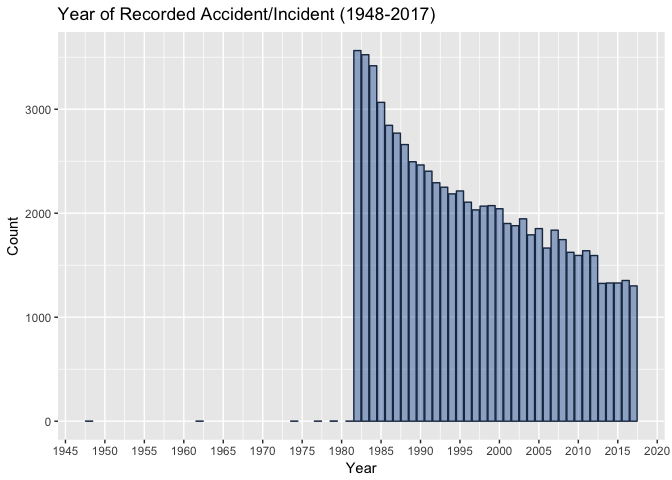

It seems the majority of the observations in the dataframe are from after the early 1980s onwards. Let's perform a quick check.

    ##    Min. 1st Qu.  Median    Mean 3rd Qu.    Max. 
    ##    1948    1987    1995    1997    2005    2017

Let's generate a plot from 1980 to 2017.

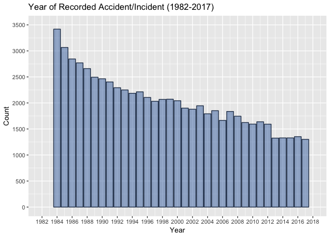

According to our plot, the number of accidents/incidents has substantially decreseased between 1982 and 2017 from approx. 3400 observations to approx. 1600 observations.

### By Month of the Year

Next, let's look at observations distribution by months of the year.

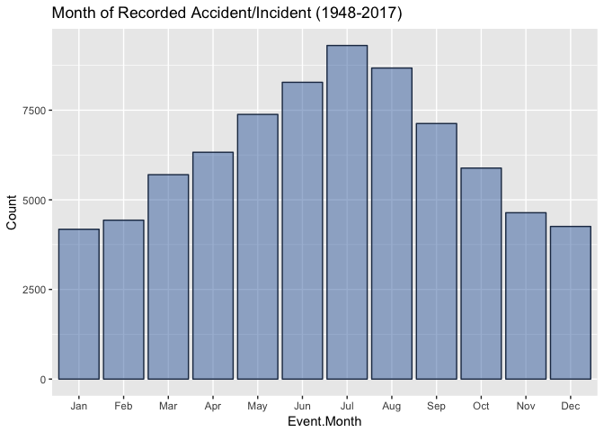

According to our plot, the highest frequency of accidents/incidents in a given year take place during northern hemisphere summer time (Jun-Jul-Aug).

### By Day of the Week

And finally, let's look at the observations distrubution by day of the week.

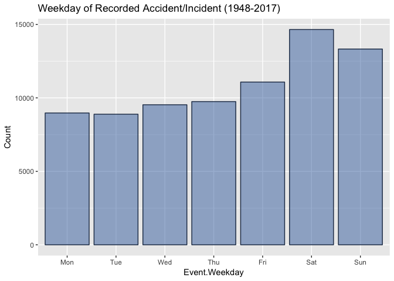

According to our plot, the highest frequency of accidents/incidents in a given week take place during the weekend (Sat-Sun).

Total Fatal Injuries
--------------------

Our next variable of interest relates to the Total Fatal Injuries for each observation in the dataset. This is quantified by the number of people injured for each recorded observation.

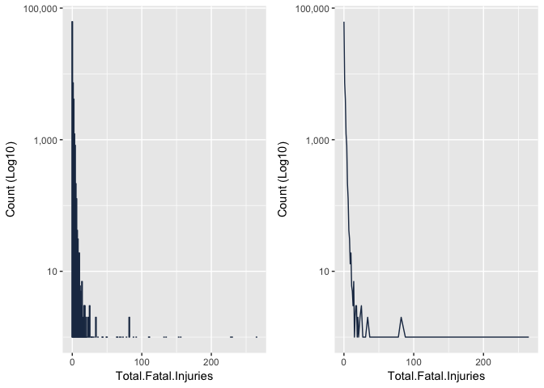

We can see that the majority of recorded accidents/incidents have a low number of fatalities while some outliers are displaying large numbers of fatalities.

Let's group the number of fatalities in buckets as shown in the plot below.

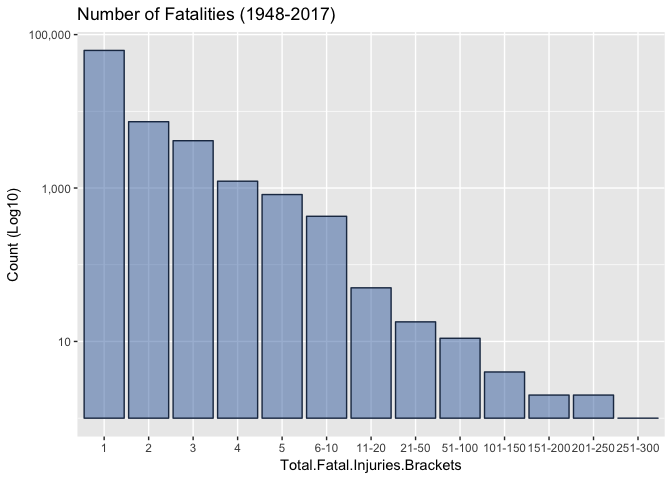

As previously stated, the charts above show that the bulk of accidents resulting in fatalities of less than 20.

Engine Types
------------

Next, we look at the engine types recorded in our observations. I've abbreviate engine type names to improve labelling of the x-axis. Note the use of the Log10 scale for the y-axis in the plot below.

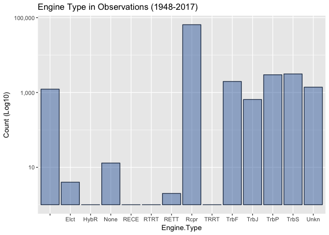

According to our charts, the bulk of engine types in the reported accidents/incidents are Reciprocal engine types.

Weather Conditions
------------------

Next, we look at the weather conditions recorded in our observations. FYI, VMC stands for visual meteorological conditions and IMC stands for instrument meteorological conditions. VMC means that conditions are such that pilots have sufficient visibility to fly the aircraft maintaining visual separation from terrain and other aircraft. IMC means weather conditions require pilots to fly primarily by reference to instruments.

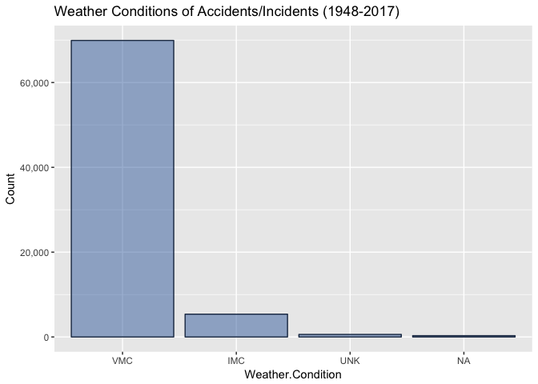

According to our plot, the bulk of accidents/incidents take place during VMC weather conditions.

Broad Phases of Flight
----------------------

Next, we look at the weather conditions recorded in our observations.

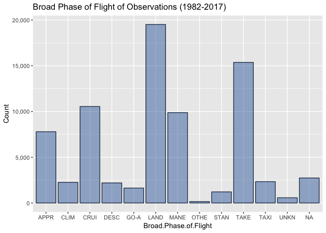

According to our plot, the bulk of accidents/incidents take place during landing or take-off.

Bivariate Plots Section
=======================

Let's look at the relationship between pairs of variables that could show interesting relationship. First a recap of available variables in our dataframe.

    ##  [1] "Event.Date"                    "Total.Fatal.Injuries"         
    ##  [3] "Engine.Type"                   "Weather.Condition"            
    ##  [5] "Broad.Phase.of.Flight"         "Latitude"                     
    ##  [7] "Longitude"                     "City"                         
    ##  [9] "State"                         "Aircraft.Category"            
    ## [11] "Event.Year"                    "Event.Month"                  
    ## [13] "Event.Weekday"                 "Total.Fatal.Injuries.Brackets"

Engine Types and Total Fatal Injuries
-------------------------------------

Let's look at the relationship of Engine Types and Total Fatal Injuries.

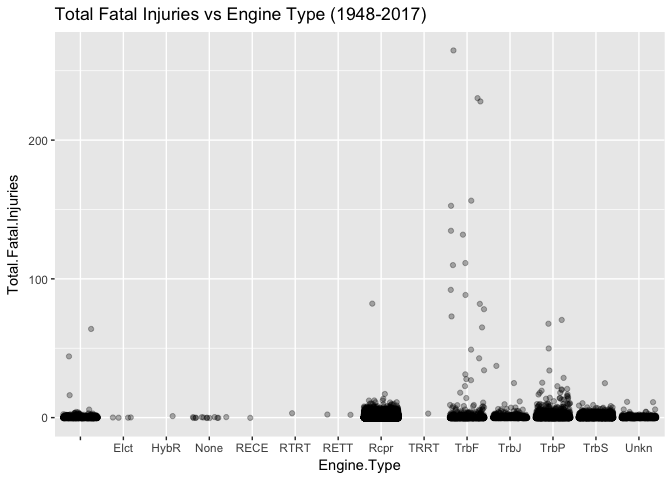

We can see that given that the bulk of the distribution has a total fatal injuries under 10, let's zoom in on that portion of the data.

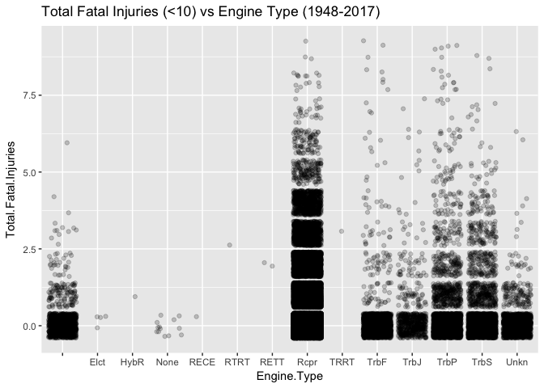

According to the plot, the bulk of the data for fatalities under 20 is with the engine type Reciprocated. The first plot shows that the Tubo-Fan engine has more outliers with higher number of fatalities than other engins. This is likely due to the use of Turbo-Fan engines use on some large commercial aircraft.

Weather Conditions and Total Fatal Injuries
-------------------------------------------

Let's look at the relationship of Weather Conditions and Total Fatal Injuries.

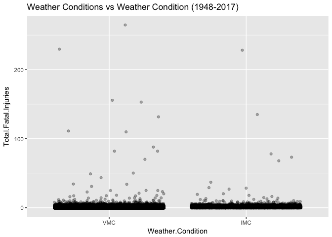

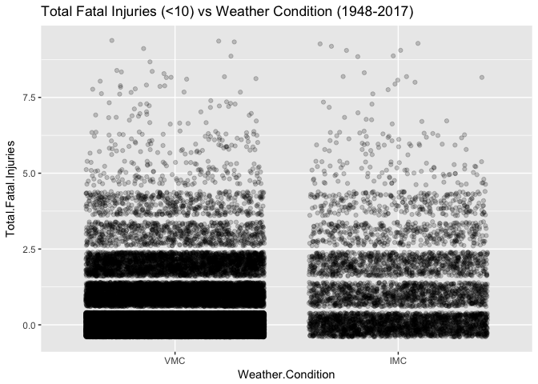

Weather conditions do not show a particularly strong relationship with total fatal injuries. The bulk of the distribution is associate with VMC weather conditions. However, that is likely to the fact that the vast majority of flights are flown in VMC conditions.

Phase of Flight and Total Fatal Injuries
----------------------------------------

Let's look at the relationship of Phase of Flight and Total Fatal Injuries

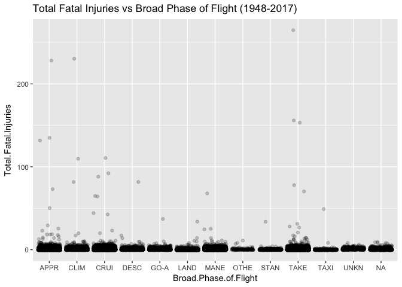

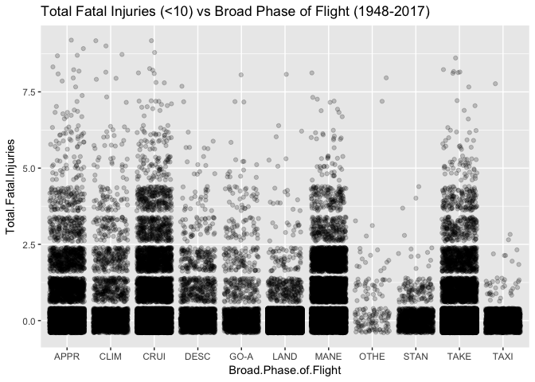

The plots show that Take-Off and Apprach are associated with outliers with high number of fatalities. These two phases of flight are often referred to as "critical phases of flight" for that particular reason. They're high risk.

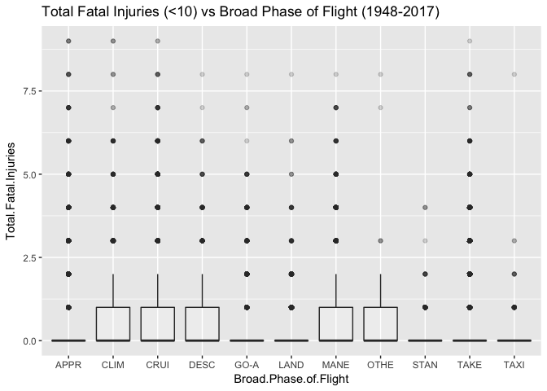

This boxplot further emphasises the presence of high outliers for take-off and approaches phases of flight. It also indicates that outliers are present for all broad phases of flight.

Event Date and Total Fatal Injuries
-----------------------------------

Let's look at the relationship of Event Date and Total Fatal Injuries

### By Month of the Year

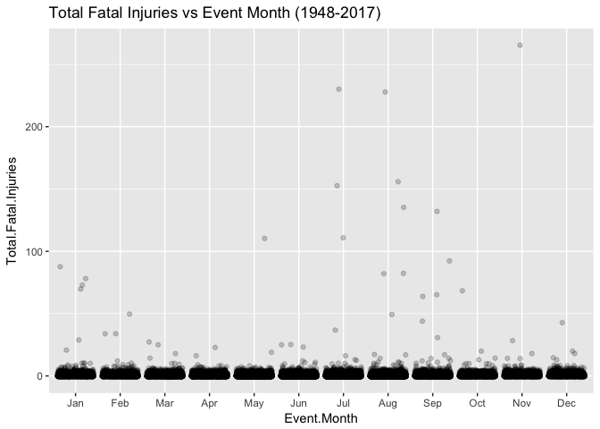

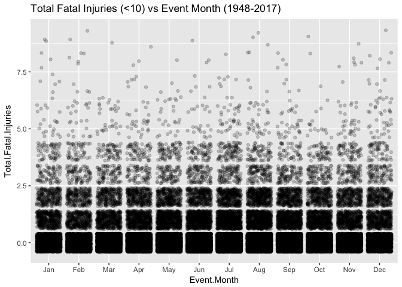

The distribution is fairly distributed across all months of the year.

### By Day of the Week

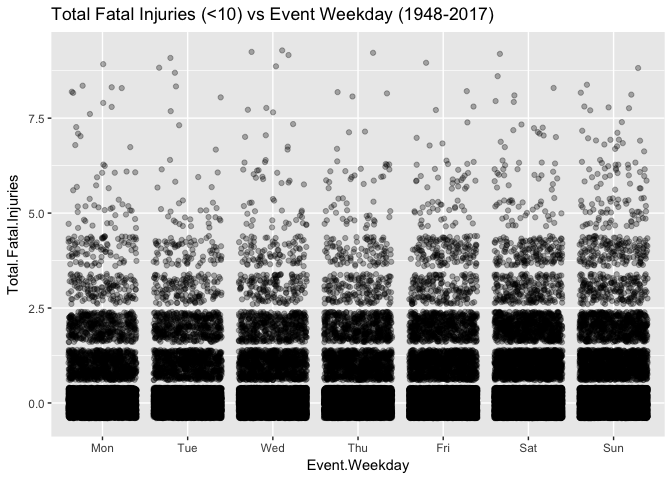

The distribution looks to be fairly distributed across all days of the week.

Broad Phase of Flight and Weather Conditions
--------------------------------------------

The relationship between weather condition and flight phase of recorded accidents/incidents was interesting. It seems there is higher frequency of recorded observations for certain combinations of weather and what we could qualify higher risk phases of flight. For instance, IMC flying conditions while during "cruise" and the "approach".This is an interesting plot as it gives an indication of which phases of flight to be particularly worried about given a particular weather condition.

Broad Phase of Flight and Event Month
-------------------------------------

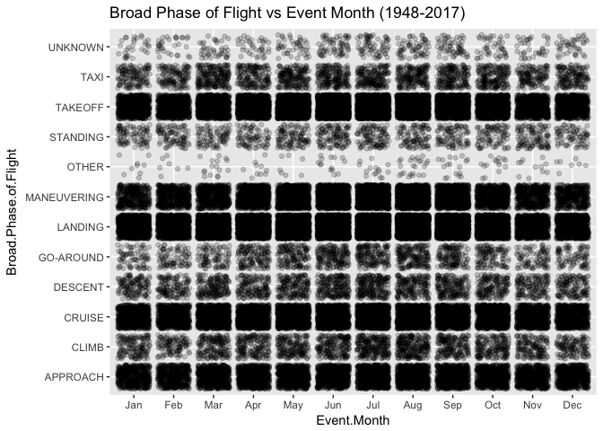

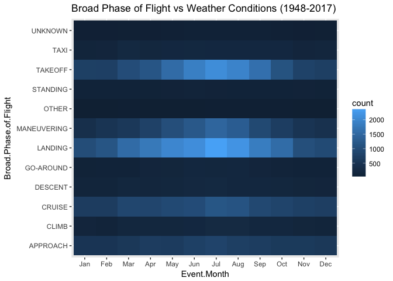

The plot indicates that there is a higher frequency of recorded observations for nothern summer months during Landing and Take-off. Across all months, the heat map also shows that the Take-off and Landing register the highest number of observations.

Longitude and Latitude
----------------------

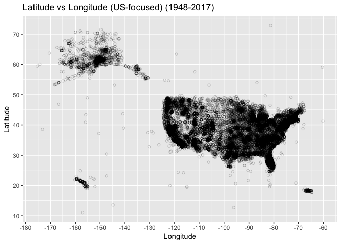

These plots are essently maps of the US and clearly shows that the coastal states are more heavily impacted that the Mid-western states and most of Alaska. This can be explained by the volume of flight to/from destinations across the US. A sad chart however as it shows that the majority of US States suffered an aviation tragedy between 1948 and 2017.

Multivariate Plots Section
==========================

Longitude and Latitude by Month
-------------------------------

First, let's look at Latitude vs Longitude of observations by Month of the Year.

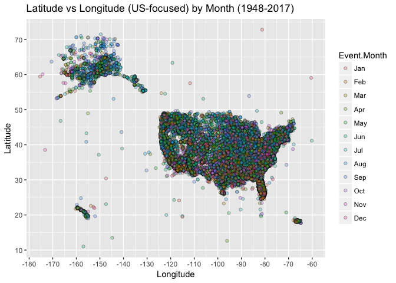

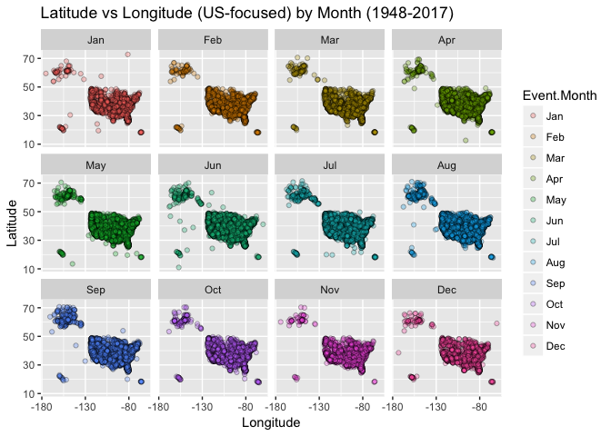

The distribution of month across latitude and longitude is fairly spread across the US, with a slightly higher prevalence of observations during the winter in southern states like Florida.

Longitude and Latitude by Weather Conditions
--------------------------------------------

Let's now look at latitude vs longitude add layer for the weather condition.

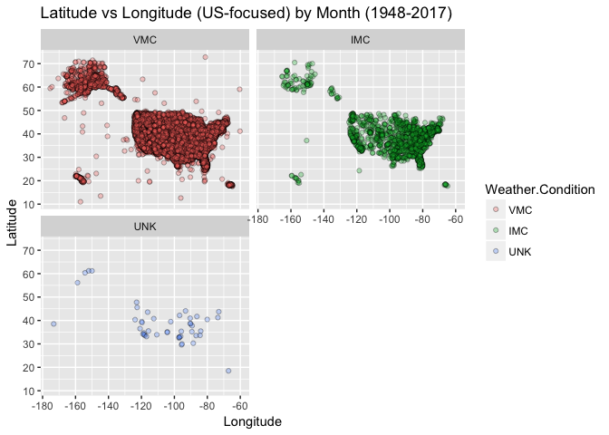

Weather condition VMC seems to be quite consistent except for patches of primarily IMC conditions for certain discrete areas.

Broad Phase of Flight and Event Month by Weather Conditions
-----------------------------------------------------------

Let's now look at the relationship of Broad Phase of Flight vs Month by Weather Conditions.

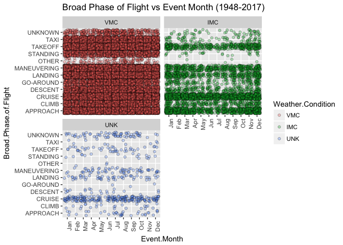

When looking at the relationship between Broad Phase of Flight vs Month and Weather Condition, we can see that accident/incidents primarily take place during VMC weather condition. However, for certain months of the year such as December an January, IMC conditions are a non-negligible portion of the observations, particularly during Approach and Cruise phases of flight.

Broad Phase of Flight and Event Month by Weather Conditions
-----------------------------------------------------------

Next, let's look at Total Fatal Injuries vs Broad Phases of Flight by Weather Condition.

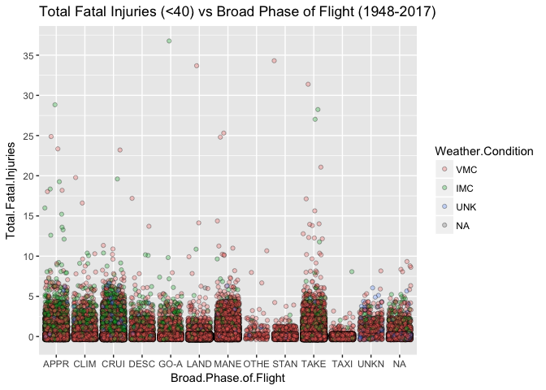

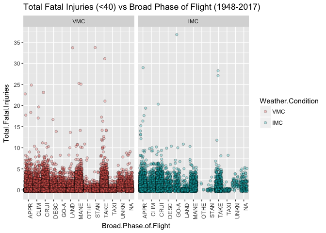

In terms of the relationship between Total Fatal Injuries vs Broad Phases of Flight and Weather Condition, the scatter plot clearly indicates that the total number of fatalies shows an increased number with IMC as weather condition and during Cruise and Approach phases of flight. Furthermore, we can see that in general, low fatality count (less then 2) primarily took place in VMC weather conditions.

Total Fatal Injuries and Engine Type by Year
--------------------------------------------

Finally, let's look at the relationship between Total Fatal Injuries vs Engine Type by Year.

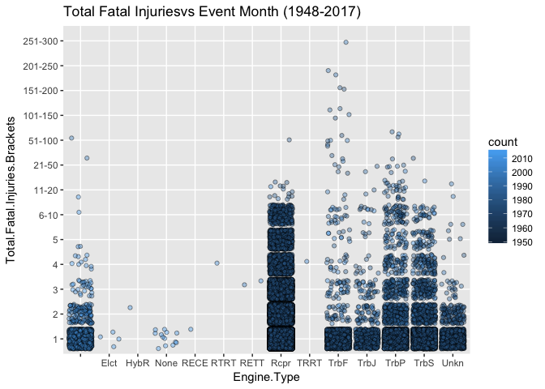

The relationship between Total Fatal Injuries vs Engine Type by Year is interesting as it also how certain engines have become prevaent in different time periods. For instance, Turbo-Jet and Turbo-Fan powered aircraft show a higher number of fatalities in later years whereas Reciprocated engies show a distribution of fatalities in earlier years.

Concluding Remarks
==================

During this EDA, I was particularly suprised by three aspects: (1) the amount of time it took to read about and understand each variable to make the best use of the given data; (2) the amount of computational power it took to process a dataset of a little less then 80,000 observations - a small sample size in our day & age; (3) and finally how much data wrangling it took to prep the data despite the fact that this is considered "clean data" after Kaggle already did the tidying.

The info from such study on Aviation Accidents could potentially inform pilots to pay particular attention for certain combination of weather conditions and phases of flight.

### Note

This R Markdown file was created as part of a lesson in UDacity's [Data Analyst Nanodegree](https://ae.udacity.com/course/data-analyst-nanodegree--nd002).
